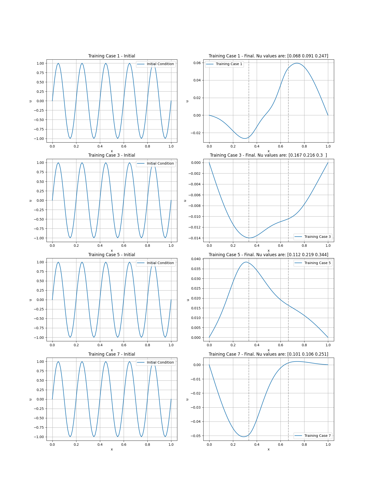

# Reduced-Order Model of PDEs Project

> **Reference**: This project is an implementation of the concepts and architecture described on the paper [CROM: Continuous Reduced-Order Modeling of PDEs Using Implicit Neural Representations](https://arxiv.org/abs/2206.02607) by Peter Yichen Chen et al.
---

## Table of Contents  

1. [**Overview**](#1-overview) 
2. [**Data Generation**](#2-data-generation)
3. [**Manifold Construction**](#3-manifold-construction)
   - [Network Details](#31-network-details)
   - [Training the network](#32-training-the-network)
   - [Testing the network](#33-testing-the-network)

---

## 1. Overview

As stated in the reference, this project is heavily based on the architecture described by Peter Yichen et al. on their paper CROM: Continuous Reduced-Order Modeling of PDEs Using Implicit Neural Representations.

The first part, constructing the low-dimensional manifold representation of the data is implemented under `/manfold_construction`.

We have chosen to implement the model for thermodynamics data, more specifically, the 1D heat equation (see [Wikipedia](https://en.wikipedia.org/wiki/Heat_equation)).

---

## 2. Data Generation

Generate data by solving the 1D heat equation:

$$
\frac{\partial u}{\partial t} - \nu(x)\frac{\partial^2 u}{\partial x^2}=0
$$

First, divide a grid of unit length into 101 spatial samples. Then, following the paper, we approximate the spatial gradient using finite differences

$$
\begin{equation}
\frac{\partial^2 u}{\partial x^2}(x^i, t_n) = \frac{u(x^i - \Delta x, t_n) + u(x^i + \Delta x, t_n) - 2u(x^i, t_n)}{\Delta x^2}
\end{equation}
$$

We compute the next-time step velocity

$$
\dot{u}_n^i = \nu(x^i) \frac{\partial^2 u}{\partial x^2}(x^i, t_n)
$$

and assume a first-order explicit time-stepping scheme

$$
u_{n+1}^i=u_n^i+\Delta t\dot{u}^i_{n+1}
$$

In particular, we have divided the spatial points into three equal regions, for which the diffusion coefficients are different and sampled from a $\mathcal{U}([0,0.4])$ distribution.
Now, to guarantee convergence of the finite difference method, we need to make sure that the Courant–Friedrichs–Lewy (CFL) condition is satisfied, that is,

$$
dt \le \frac{\Delta x^2}{2\max \nu(x)}
$$

In this case, our maximum value of $\nu$ is 0.4, so we choose 2000 timesteps to have a sufficiently small $dt$. Our initial temperature profile is always that of a sinusoid.

Here is a short animation:

https://github.com/user-attachments/assets/25decb0c-226a-4fa3-ae5b-52ed8b7e1387

And some initial and final results for different conditions:



---

## 3. Manifold Construction

### 3.1 Network details

- `manifold_construction/full_network`: Is the full nework implementation. Combines the `Encoder` and `Decoder`. Takes input data, encodes it into a lower-dimensional latent representation, then decodes it back to the original space. Uses MSE loss and Adam optimizer with a custom learning rate schedule.
  
- `manifold_construction/encoder`: Applies multiple 1D convolution layers with kernel size 6 and stride 4 to reduce the input dimensionality. Finally, two linear layers map the result to the latent space (`label_length`).

- `manifold_construction/decoder`: A multi-layer perceptron (MLP) with 5 hidden layers of width scaled 20. Transforms the latent representation back to the original data space.

- **Training & Testing**: Uses PyTorch Lightning’s `Trainer`, with different steps for training, testing, and saving results.

### 3.2 Training the network

We train the network with an epoch sequence of `[3000, 3000, 3000, 3000, 3000, 1000]` with a learning rate scaling sequence of `[10, 5, 2, 1, 0.5, 0.2]` and an initial learning rate of 1e-4.

To train the network, run

```bash
python manifold_construction/full_network.py -mode train
```

### 3.3 Testing the network

To test the network, run

```bash
python manifold_construction/full_network.py -mode test
```

